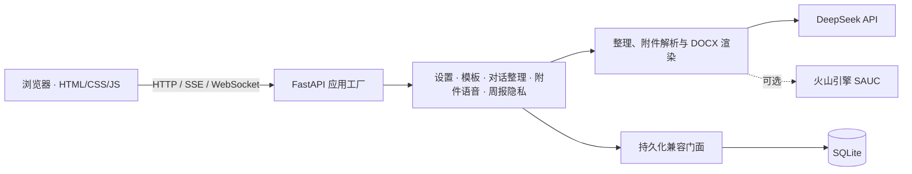

# Weeknote · 周报助手

[](https://github.com/liiiyiiixiii/weeknote/actions/workflows/ci.yml)
[](https://www.python.org/)
[](LICENSE)

Weeknote 是一个面向中文工作记录的自托管周报助手。它把一周中零散的文字、文档和语音整理成结构清晰的周报，并导出为 Word；同时提供模板管理、历史版本与匿名访客数据隔离。


> [!IMPORTANT]
> 项目会把用户主动提交的文字和附件提取内容发送给所配置的大模型服务。请先确认数据合规要求，不要提交密钥、生产数据库、真实服务器配置或敏感业务资料。

## 功能

- 将中文零散笔记忠实整理为《工作汇报》和《技术总结》，不虚构事实
- 支持 DOCX、PPTX、PDF、Markdown、CSV、Excel、常用文本、图片 OCR 与 ZIP 附件
- 通过可视化编辑、样例学习或 AI 对话创建自定义模板
- 在网页中预览结果，并导出排版规范的 `.docx`
- 按周保存多个独立版本，支持回看、重新导出和删除
- 可选火山引擎 SAUC 实时语音识别
- 以签名匿名浏览器身份隔离设置、模板、历史和额度
- 对文件大小、解压体积、页数、像素、并发和每日调用量设置边界

## 快速开始

需要 Python 3.12。图片 OCR 还需要系统安装 Tesseract，并提供 `chi_sim` 与 `eng` 语言包。

```bash
git clone https://github.com/liiiyiiixiii/weeknote.git
cd weeknote/backend
python3.12 -m venv .venv
source .venv/bin/activate
python -m pip install -r requirements-dev.txt
cp .env.example .env
```

在 `backend/.env` 中填写 `DEEPSEEK_API_KEY`，然后启动：

```bash
uvicorn app.main:app --reload --port 8000
```

访问 <http://127.0.0.1:8000>。首次打开可在设置中选择周起始日、报告标题和模板。

## 技术栈

- 后端：FastAPI、Uvicorn、SQLite、Pydantic
- 模型：DeepSeek OpenAI 兼容 API
- 文档：python-docx、PyMuPDF、python-pptx、openpyxl、pytesseract
- 前端：原生 HTML、CSS、JavaScript，无构建运行时
- 工程质量：Ruff、Pytest、Coverage、Prettier、pip-audit、Gitleaks

## 架构



`app.main:create_app` 负责应用装配、中间件、生命周期与路由注册。API 按领域拆分，持久化层按数据库、周报、模板、额度、会话、附件、草稿和租约提供接口；`app.storage` 与 `app.runtime_store` 继续作为兼容入口。

## 目录结构

```text
.
├── backend/
│   ├── app/
│   │   ├── api/routers/       # 分领域 API 路由
│   │   ├── core/              # 配置、中间件和生命周期
│   │   ├── persistence/       # 持久化接口与实现
│   │   └── main.py            # 应用工厂与兼容入口
│   ├── static/                # 原生 Web 界面
│   ├── tests/                 # 回归与安全边界测试
│   └── .env.example           # 无密钥配置示例
├── deploy/                    # 通用 Nginx / systemd 模板
├── docs/images/               # 脱敏项目截图
└── .github/                   # CI、Dependabot 与协作模板
```

## 配置

所有配置通过环境变量提供。完整清单和安全默认值见 [`backend/.env.example`](backend/.env.example)。

| 变量 | 必需 | 默认值 | 用途 |
| --- | --- | --- | --- |
| `DEEPSEEK_API_KEY` | 是 | 空 | DeepSeek API 密钥 |
| `DEEPSEEK_BASE_URL` | 否 | `https://api.deepseek.com` | OpenAI 兼容 API 地址 |
| `DEEPSEEK_MODEL` | 否 | `deepseek-v4-flash` | 整理与模板分析模型 |
| `APP_ENV` | 否 | `development` | 运行环境；生产使用 `production` |
| `APP_SECRET` / `APP_SECRET_FILE` | 生产必需 | 空 | 匿名身份签名密钥；优先使用受限文件 |
| `APP_PUBLIC_ORIGIN` | 生产必需 | 空 | 对外 HTTPS Origin |
| `APP_COOKIE_PATH` | 否 | `/` | 部署在子路径时的 Cookie 路径 |
| `APP_DB_PATH` | 否 | `backend/data.db` | SQLite 数据库位置 |
| `ALLOWED_HOSTS` | 否 | `*` | 允许的 Host；生产应设为实际域名 |
| `MESSAGE_DAILY_LIMIT` | 否 | `10` | 每个来源 IP 每日消息上限 |
| `ASR_MAX_SECONDS` | 否 | `120` | 单次录音秒数上限 |
| `ASR_DAILY_SECONDS_LIMIT` | 否 | `600` | 每个来源 IP 每日语音秒数上限 |
| `REPORT_RETENTION_DAYS` | 否 | `365` | 周报保留天数，`0` 表示不自动清理 |
| `USAGE_RETENTION_DAYS` | 否 | `90` | 额度记录保留天数，`0` 表示不自动清理 |

语音识别另需配置 `VOLC_API_KEY`，或旧版鉴权所需的 `VOLC_APP_KEY` 与 `VOLC_ACCESS_KEY`。

## API 概览

| 接口 | 方法 | 说明 |
| --- | --- | --- |
| `/api/health` | `GET` | 健康状态和发布版本 |
| `/api/settings` | `GET`, `PUT` | 当前匿名身份设置 |
| `/api/chat` | `POST` | SSE 对话流 |
| `/api/organize` | `POST` | 整理并持久化周报 |
| `/api/attachments` | `POST` | 上传并提取附件 |
| `/api/templates` | `GET`, `POST` | 模板列表与创建 |
| `/api/weeks` | `GET` | 历史周报列表 |
| `/api/weeks/{week_id}/export` | `GET` | 导出 DOCX |
| `/api/privacy` | `GET` | 数据保留与隐私说明 |
| `/ws/asr` | WebSocket | 可选实时语音识别 |

启动后可在 `/docs` 查看完整 OpenAPI 文档。URL、JSON/SSE/WebSocket 协议和 SQLite schema 会遵循语义化版本兼容策略。

## 数据与隐私

- 默认数据保存在本地 SQLite；附件原始二进制不会写入业务数据库
- 附件提取文本、摘要、未完成对话和模板草稿最多暂存 6 小时
- 归档或删除数据时会同步清理临时附件内容；帮助面板可删除当前匿名身份全部数据
- 文字、附件提取内容和模板样例会发送给 DeepSeek；启用语音时，音频会发送给火山引擎
- 生产配置支持跨进程租约和 2 个 Uvicorn worker，但 SQLite 仍更适合个人或小团队负载

从早期版本升级时，可先只读审计历史附件内容：

```bash
cd backend
python scripts/privacy_maintenance.py
# 备份数据库并确认审计结果后：
python scripts/privacy_maintenance.py --apply
```

## 开发与测试

根目录提供统一命令：

```bash
make setup          # 安装 Python 与前端开发依赖
make format         # Ruff + Prettier 自动格式化
make check          # 格式、lint、测试、覆盖率、依赖与密钥检查
```

CI 要求 Python 测试的分支覆盖率至少为 75%，并执行 Compileall、`pip check`、`pip-audit`、Prettier 和完整 Git 历史 Gitleaks 扫描。贡献流程见 [CONTRIBUTING.md](CONTRIBUTING.md)。

## 部署

[`deploy/`](deploy/) 仅包含使用 `example.com`、`/opt/weeknote` 和专用数据目录的公开模板。生产部署建议：

1. 使用独立系统账号和 Python 虚拟环境安装应用。
2. 将环境变量保存在权限为 `0600` 的 `/etc/weeknote.env`，签名密钥使用独立文件。
3. 让 Uvicorn 仅监听本机地址，由 Nginx 提供 HTTPS、限流和安全响应头。
4. 更新前使用 SQLite `.backup`，在备用端口检查健康、模板、历史与导出后再切换。

不要把填写后的 `.env`、数据库、日志、证书、生产部署文件或服务器资料提交到 Git。

## 当前限制

- 没有账号系统，身份依赖当前浏览器中的签名匿名 Cookie
- 主要为中文周报场景设计，提示词与文档排版尚未系统适配其他语言
- SQLite 和单机文件处理不适合高并发、多节点部署
- OCR 准确率取决于 Tesseract 语言包与源图片质量

## 参与贡献

欢迎通过 Issue 提交可复现的问题和范围清晰的功能建议。安全问题请遵循 [SECURITY.md](SECURITY.md)，不要在公开 Issue 中粘贴密钥、服务器地址或真实业务数据。

## License

本项目采用 [MIT License](LICENSE)，Copyright © 2026 liiiyiiixiii。
